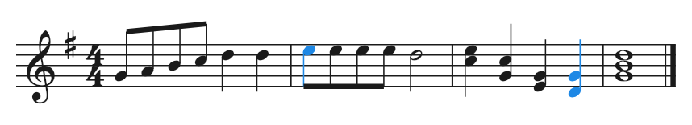

# crisp_notation

Music notation rendering for Dart & Flutter, with first-class interactivity.

**Status: published on pub.dev** — [`crisp_notation`](https://pub.dev/packages/crisp_notation)
0.4.1, [`crisp_notation_core`](https://pub.dev/packages/crisp_notation_core) 0.4.3,
[`crisp_notation_cli`](https://pub.dev/packages/crisp_notation_cli) 0.4.3.
Active development follows
[PLAN.md](PLAN.md). API guarantees consumers may rely on are in
[docs/CONTRACT.md](docs/CONTRACT.md); design decisions are logged in
[docs/DESIGN.md](docs/DESIGN.md); the running feature log is each package's
CHANGELOG ([core](packages/crisp_notation_core/CHANGELOG.md),
[Flutter](packages/crisp_notation/CHANGELOG.md), [CLI](packages/crisp_notation_cli/CHANGELOG.md)).



| Package | Contents | Depends on |
|---|---|---|
| [`crisp_notation_core`](packages/crisp_notation_core) | Music theory model (pitch, duration, key, scale, chord, harmonic function), score document model, deterministic layout engine. Pure Dart. | Dart SDK only |
| [`crisp_notation`](packages/crisp_notation) | Flutter rendering (`StaffView`, wrapped `MultiSystemView`) and interaction (`InteractiveStaff`, `InteractiveGrandStaffView`): hit-testing, selection, drag-to-staff, hover caret + ghost-note preview, error/loop overlays and a `ScoreEditorController`. Bundles the Bravura SMuFL font. | Flutter, `crisp_notation_core` |
| [`crisp_notation_cli`](packages/crisp_notation_cli) | Command-line tool: inspect scores, convert between MusicXML / `.mxl` / MIDI / MuseScore / `.gp` / ABC, render to SVG (notation or tab). Pure Dart. | `crisp_notation_core` |

## Install

```sh
flutter pub add crisp_notation          # Flutter rendering + interaction
dart pub add crisp_notation_core        # pure-Dart theory/layout/interchange only
```

`crisp_notation` pulls in `crisp_notation_core` itself — add the core directly
only if you want the pure-Dart layer without Flutter.

The CLI installs from pub.dev too, which puts a `crisp_notation` command on your
`PATH`:

```sh
dart pub global activate crisp_notation_cli
crisp_notation --help
```

It is also published as prebuilt native binaries on each
[release](https://github.com/CrispStrobe/crisp_notation/releases)
(macOS/Linux/Windows).

To track `main` ahead of the releases, depend on it from git instead:

```yaml
dependencies:
  crisp_notation:
    git: { url: https://github.com/CrispStrobe/crisp_notation.git, path: packages/crisp_notation }
  crisp_notation_core:
    git: { url: https://github.com/CrispStrobe/crisp_notation.git, path: packages/crisp_notation_core }
```

## Why another notation library?

VexFlow, OpenSheetMusicDisplay and abcjs are JavaScript and render statically.
crisp_notation targets Flutter apps that need **interactive** notation — education
games, ear-training, theory drills — where every notehead must be tappable,
draggable and highlightable.

Not (yet) a full engraver, but closing in — see [PLAN.md](PLAN.md).

**Engraving.** Notes/rests breve→64th with dots, accidentals with measure
memory (including quarter-tone **microtones**), chords, multi-level beaming
(feathered, forced-slant, over rests), tuplets, ties (incl. laissez-vibrer /
"let ring"), slurs, articulations (incl. up/down bow), ornaments and **extended
trills** (`tr` + wavy line), dynamics + hairpins, grace notes and **cue / small
notes**, tremolo. Notehead schemes for teaching — shape notes (Sacred Harp
four-shape, Aikin seven-shape), pitch-letter and movable-do **solfège** heads.
Key/time signatures with mid-score changes, common/cut, **additive/composite**
meters (metric beam grouping — 6/8 in threes, 3+2/8 by components) and
**non-standard key signatures**; a full range of barline styles (tick, short,
reverse-final, …); repeats, voltas and D.C./D.S./coda navigation.
**Skyline collision avoidance** places accidentals, articulations, dynamics,
ornaments and slurs against each glyph's actual ink, per column.

**Structure.** N-staff systems and grand staff with brackets/braces, automatic
line-breaking into systems, **cross-staff onset-column gridding** (simultaneous
notes align vertically across staves), pagination with margins and vertical
justification, pickup/anacrusis with measure numbering, transposing instruments
with a concert-pitch toggle. Clefs: treble/bass/alto/tenor plus French-violin,
soprano, mezzo-soprano, baritone and sub-bass (+ octave variants) and a neutral
percussion clef.

**Breadth.** Lyrics (verses, hyphenation, melisma, elision/synalepha), figured
bass (slashed figures, continuation lines, SATB realization), chord symbols,
jazz articulations, breath marks, custom noteheads and per-element coloring, and
full guitar **tablature** with techniques (bends/whammy/slides, grace notes,
ornaments, right-hand fingering, slap/pop, rasgueado, tremolo picking).

**Interaction.** Every notehead is tappable, draggable and highlightable — on a
single staff, a width-wrapped `MultiSystemView`, or an `InteractiveGrandStaffView`
(taps report the system + staff). A hover caret and a translucent ghost-note
preview drive note entry; drag hooks move existing notes; an
`ElementRegionController` exposes per-element hit rectangles (`elementRegions` /
`elementIdsIn`) for marquee selection and drag-to-reorder. For player/editor
apps there is an editor overlay layer — per-note `EditorMark`s (colour +
message, e.g. wrong/flagged), a translucent loop/selection band, and
`rectOfElement(id)` scroll-to-note geometry — orchestrated by a
`ScoreEditorController` (`setLoop`, `mark`, `highlight`, `scrollToNote`) that
drives an app-owned `ScrollController`. One-call `exportScoreToPng` /
`exportScoreToSvg` (with the engraving font embedded) back print / page export.

**Interchange.** MusicXML (plain and compressed `.mxl`), MEI, Humdrum `**kern`,
MIDI, MuseScore (`.mscx`/`.mscz`), the `.gp3`–`.gp5`/`.gpx`/`.gp` tablature
family (with GPIF), ABC, and LilyPond (`.ly`) — all importing and (where applicable) exporting
through the one `Score` model, so any pair round-trips for shared data; plus
braille-music (`.brl`) export. The GPIF export/import is a
high-fidelity round-trip: on top of pitches, chords, rhythm, per-track tunings
and the tab techniques (bends & contours, hammer-ons, slides, vibrato, dead/
ghost/harmonics), it preserves **voice 2, tuplets, key signature (incl. mid-score
changes), dynamics, grace notes, articulations and lyrics** — verified across 25
real Guitar-Pro files. The binary readers are **fuzz-hardened** (blind +
coverage-guided [covfuzz](https://pub.dev/packages/covfuzz)): malformed input is
rejected with a `FormatException`, never a crash or hang.

**Optical music recognition.** A staff-notation image imports to a score via
[CrispEmbed](https://github.com/CrispStrobe/CrispEmbed), auto-routing three
engines through one `crisp_notation omr` command: the Sheet Music Transformer
(grand staff → `GrandStaff`, via `bekern` tokens), Polyphonic-TrOMR (single
polyphonic staff → `Score`, via *semantic* notation), and Flova (handwritten /
whiteboard staves → `Score`, via LilyPond "simple notes"). A full-page scan is
split into staff systems (`--page`) and transcribed end to end; models
auto-download by name from Hugging Face. All map into the one `Score` model, so a
scan then exports like any other input (image → MusicXML/`**kern`/…). The
token→score conversion is pure Dart; the recognition engine loads over FFI, and
the whole pipeline is reusable as `package:crisp_notation_cli/omr.dart` (CLI or
Flutter desktop, wherever `dart:ffi` works).

**Beyond the category.** A renderer-free deterministic layout engine,
hit-testing, a highlight/timing pipeline, educational overlays (note names,
beat counts), SVG/PNG export, a CLI, and a WasmGC-compilable core that runs the
theory + interchange codecs in the browser (`dart compile wasm`).

Still out: page frames/spacers and a physical mm/spatium scaling unit
(in progress); audio synthesis (never).

## License

Code: [MIT](LICENSE). Bundled Bravura font: SIL OFL 1.1 (© Steinberg Media
Technologies GmbH), see [OFL.txt](packages/crisp_notation/assets/fonts/OFL.txt).

## Development

Pub workspace (Dart ≥ 3.5): `dart pub get` at the repo root resolves all three
packages. Gates: `dart format .`, `flutter analyze`, `flutter test` in each
package.
